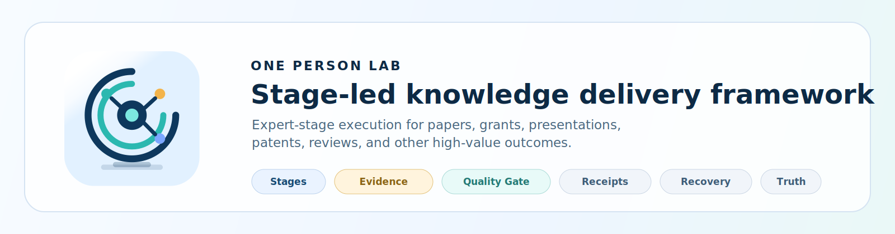
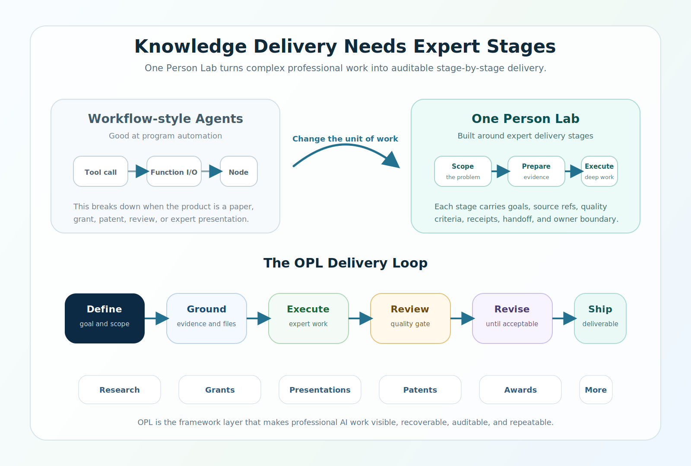
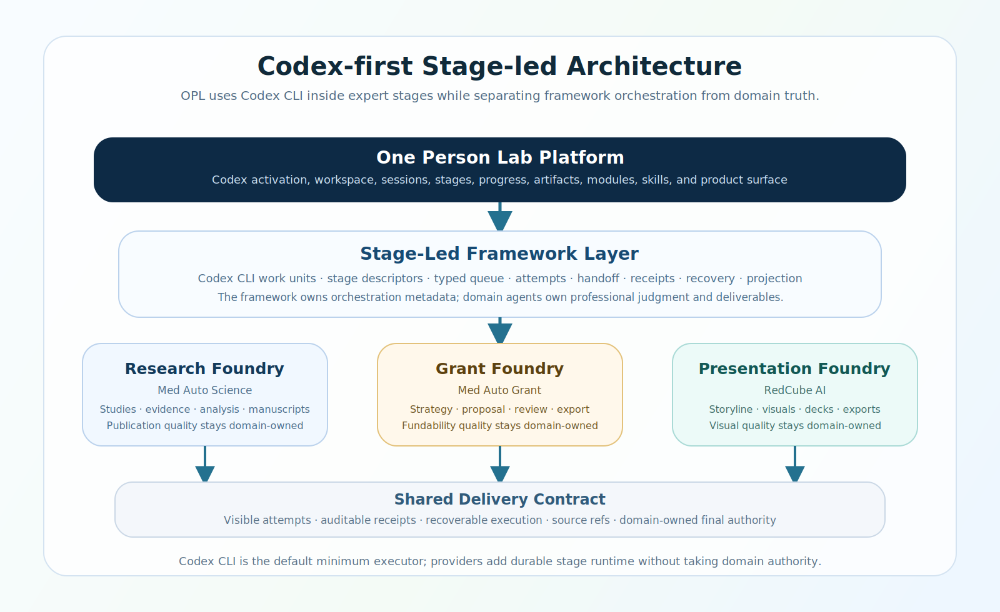

<p align="center">
  
</p>

<p align="center">
  <a href="./README.md"><strong>English</strong></a> | <a href="./README.zh-CN.md">中文</a>
</p>

<h1 align="center">One Person Lab</h1>

<p align="center"><strong>One workbench for serious research, grant, and presentation work</strong></p>
<p align="center">Start expert work, keep progress visible, and collect deliverables in one trusted place.</p>

<p align="center">
  
</p>

<p align="center">
  
</p>

## What New Users Can Do First

- **Medical research**: move evidence organization, analysis, manuscript drafts, and deliverable packages forward.
- **Grant applications**: shape a grant direction, structure a proposal, and prepare revision packages.
- **Presentations and PPT**: prepare lectures, lab talks, defenses, and project reports.
- **General long-running work**: keep discussion, file reading, document editing, progress, and deliverables in one place.

## Fast Start

For macOS desktop users, download the App directly:

[Download One Person Lab for macOS](https://github.com/gaofeng21cn/one-person-lab/releases/download/v26.4.25/One.Person.Lab-26.4.25-mac-arm64.dmg)

Open `One Person Lab.app`; on first launch it prepares the local environment and helps configure Codex, modules, skills, and the desktop workbench without opening any extra service window.

If you prefer Terminal installation:

```bash
curl -fsSL https://raw.githubusercontent.com/gaofeng21cn/one-person-lab/main/install.sh | bash
```

After installation, open `One Person Lab.app`, choose a workspace root, and start general work, medical research, grant writing, or presentation/PPT work from the same interface.

Need Docker, Linux, or server deployment? See the [Docker and browser deployment reference](./docs/references/opl-docker-webui-deployment.md).

## Current Product Families

| Product family | Current product | Best for | Typical deliverables |
| --- | --- | --- | --- |
| `Research Foundry` | [`Med Auto Science`](https://github.com/gaofeng21cn/med-autoscience) | Medical research, evidence organization, manuscript preparation, deep analysis | Analysis packages, evidence packages, manuscripts |
| `Grant Foundry` | [`Med Auto Grant`](https://github.com/gaofeng21cn/med-autogrant) | Grant direction setting, proposal writing, revision work | Proposals, outlines, revision packs |
| `Presentation Foundry` | [`RedCube AI`](https://github.com/gaofeng21cn/redcube-ai) | Lectures, lab talks, reports, defense materials | Slide decks, scripts, presentation packages |
| `IP Foundry` | `Med Auto Patent` planned | Patent applications, invention disclosures, claims, embodiment organization | Invention disclosures, patent drafts, claim sets |
| `Award Foundry` | `Med Auto Award` planned | Science-and-technology award applications, achievement summaries, impact evidence | Award applications, achievement summaries, evidence packs |
| `Thesis Foundry` | `Med Auto Thesis` planned | Thesis assembly and defense preparation | Chapter drafts, defense materials |
| `Review Foundry` | `Med Auto Review` planned | Review, rebuttal, and revision work | Review comments, response drafts, revision plans |

## How The Workbench Is Organized

- General work for discussion, planning, reading, and common tasks.
- Workspace-based work for tasks that need a real directory and persistent file context.
- Specialized product families for domain-specific expert workflows.
- Progress and file views that stay attached to ongoing work.
- Central management for engines, modules, skills, GUI, and health status.

## For Agents And Technical Operators

<details>
  <summary><strong>Quick technical entry</strong></summary>

### One instruction for a Codex Agent

> Install and configure this OPL repo: clone it, install the OPL CLI, run `opl install`, and ensure Codex CLI, Hermes-Agent, MAS/MDS/MAG/RCA, recommended skills, the One Person Lab App, and the browser entry are ready; if anything is missing, fix it or report the exact blocker.

### Common commands after installation

```bash
opl system initialize   # Inspect the Codex version policy, Hermes-Agent, modules, skills, GUI, and workspace-root state
opl modules             # Check MAS/MDS/MAG/RCA module installation and health
opl skill sync          # Sync OPL family skills into the Codex-visible skill path
opl help --text         # Human-readable help; use opl help --json for machine-readable output
```

### What this repository tracks

This repository tracks the shared OPL workbench layer, not the specialized domain-agent implementations. It keeps the product family coherent by providing:

- A common place to start and resume expert work.
- Module installation, skill sync, service setup, and health checks.
- Workspace, session, progress, and artifact discovery surfaces.
- Shared contracts that let Research, Grant, and Presentation Foundries stay visible from one workbench.

The desktop GUI source is maintained in [`opl-aion-shell`](https://github.com/gaofeng21cn/opl-aion-shell) as an internal OPL-branded app-shell build input. Users download One Person Lab App packages from this repository’s GitHub Releases, and this repository provides the shared workbench contracts and product surfaces consumed by the app and Codex.

### How to read this repository

1. Users should start with this README and the App / `opl install` path above.
2. Technical planning, architecture decisions, and direction sync continue through the [documentation index](./docs/README.md), then [project overview](./docs/project.md), [current status](./docs/status.md), [architecture](./docs/architecture.md), [invariants](./docs/invariants.md), and [decisions](./docs/decisions.md).
3. Developers and maintainers should continue with the [contracts directory guide](./contracts/README.md), [reference index](./docs/references/README.md), and tracked materials under `docs/specs/`, `docs/plans/`, and the [history index](./docs/history/README.md).

### Runtime notes

- Default front doors are `opl`, `opl exec`, and `opl resume`. Unless a runtime or domain agent is explicitly selected, these paths keep Codex-default semantics.
- OPL treats `Codex CLI` as a managed runtime dependency: `opl system` reports the selected binary, version, minimum-version policy, and conflicting PATH candidates; versions below the minimum or conflicting candidate versions are marked `attention_needed`.
- If an admitted domain repo is missing locally, run `opl module install --module <module_id>`.
- The default local state directory is `~/Library/Application Support/OPL/state`. Set `OPL_STATE_DIR` to use another local state root.
- Active domain agents are [`Med Auto Science`](https://github.com/gaofeng21cn/med-autoscience), [`Med Auto Grant`](https://github.com/gaofeng21cn/med-autogrant), and [`RedCube AI`](https://github.com/gaofeng21cn/redcube-ai).
- [`Med Deep Scientist`](https://github.com/gaofeng21cn/med-deepscientist) remains the controlled runtime/backend companion under `Med Auto Science`; OPL install and Environment Management maintain it as a MAS dependency, but it is not a top-level OPL domain agent.
- When a task needs top-level session/runtime paths, shared `workspaces / sessions / progress / artifacts` surfaces, or explicit domain activation, enter through `OPL`. When a task is already clearly inside one domain, continue through that repo’s README and `docs/README*`.

</details>

## Further Reading

- [Roadmap](./docs/roadmap.md)
- [Task map](./docs/task-map.md)
- [Operating model](./docs/operating-model.md)
- [Unified Harness Engineering Substrate](./docs/unified-harness-engineering-substrate.md)
- [Documentation index](./docs/README.md)
- [Project overview](./docs/project.md)
- [Current status](./docs/status.md)
- [Contracts directory guide](./contracts/README.md)
