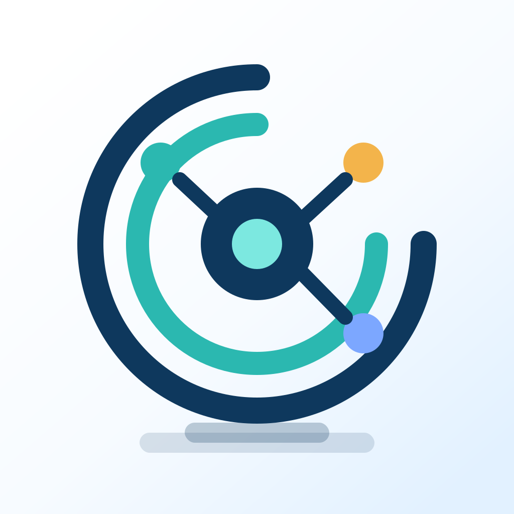

<p align="center">
  
</p>

<p align="center">
  <a href="./README.md"><strong>English</strong></a> | <a href="./README.zh-CN.md">中文</a>
</p>

<h1 align="center">One Person Lab Framework</h1>

<p align="center"><strong>Stage-led agent framework for high-value knowledge delivery.</strong></p>
<p align="center">Build OPL-compatible domain agents, run durable expert stages, and keep domain truth in the owning agent repositories.</p>

<p align="center">
  
</p>

## What This Repository Is

`one-person-lab` is the OPL Framework repository. It is not the desktop App product repository.

Most agent frameworks model work as graph nodes, tool calls, function inputs, and activity outputs. OPL uses expert stages as the core unit instead. A stage carries a goal, source material, quality criteria, handoff, receipt, and owner boundary. Inside each stage, a domain agent can read, reason, write, compute, review, and revise before returning a domain-owned verdict.

The framework keeps that work visible, recoverable, auditable, and ready for the next stage.

## Three Layers

| Layer | Repository / owner | Responsibility |
| --- | --- | --- |
| **OPL Framework** | `gaofeng21cn/one-person-lab` | CLI, activation, stage control, runtime/provider bridge, typed queue, contracts, module discovery, skill sync, runtime snapshots, and projection consumption. |
| **One Person Lab App** | [`gaofeng21cn/one-person-lab-app`](https://github.com/gaofeng21cn/one-person-lab-app) | End-user desktop workbench, packaging, release assets, updater metadata, first-run checks, GUI page-state tests, screenshots, and user guides. |
| **Foundry Agents** | MAS / MAG / RCA repositories | Domain truth, quality verdicts, artifact authority, stage semantics, prompts, skills, and deliverable gates. |

The App consumes framework-owned machine-readable surfaces and domain-owned projections. It does not own OPL runtime truth, provider implementation, MAS/MAG/RCA domain truth, or artifact authority.

## Framework Scope

This repository provides the framework layer that OPL-compatible agents can rely on:

- `opl` CLI entry points for installation, initialization, execution, resume, diagnostics, and repair.
- Explicit activation, stage control, handoff, receipts, human gates, and recovery surfaces.
- Provider-backed family runtime support, typed queue, stage attempt ledger, runtime snapshots, and projection consumption.
- Machine-readable contracts under `contracts/`.
- Module discovery and `opl module exec` so MAS/MAG/RCA commands run from the resolved checkout.
- Skill synchronization for the OPL family skill pack.

Temporal-backed provider support is the production online runtime substrate. Local providers are dev/CI/offline diagnostics. Codex CLI remains the current first-class Agent executor; Hermes-Agent, Claude Code, and similar tools can only enter as explicit executor adapters with receipts and auditability.

## Current Foundry Agents

| Foundry line | Domain agent | Best for | Authority boundary |
| --- | --- | --- | --- |
| `Research Foundry` | [`Med Auto Science`](https://github.com/gaofeng21cn/med-autoscience) | Medical research, evidence organization, manuscript preparation, deep analysis | Medical research runtime, controller truth, quality authority, publication/package gates. |
| `Grant Foundry` | [`Med Auto Grant`](https://github.com/gaofeng21cn/med-autogrant) | Grant direction setting, proposal writing, revision work | Grant domain memory, proposal quality, package authority, reviewer/revision decisions. |
| `Presentation Foundry` | [`RedCube AI`](https://github.com/gaofeng21cn/redcube-ai) | Lectures, lab talks, reports, defense materials | Visual deliverable runtime, deck/package authority, design and artifact quality gates. |

Planned future foundries include Patent, Award, Thesis, and Review agents. They should publish as OPL-compatible repositories/packages instead of embedding a separate copy of the OPL runtime.

## Framework Quick Start

Install from this repository when you want the developer/operator framework:

```bash
curl -fsSL https://raw.githubusercontent.com/gaofeng21cn/one-person-lab/main/install.sh | bash
opl system initialize
```

Useful framework commands:

```bash
opl help --text
opl modules
opl module exec --module medautoscience -- doctor entry-modes
opl skill sync
opl family-runtime status
opl family-runtime repair
opl family-runtime attempt list
```

Use `opl help --json` and contract files when building automation that needs stable machine-readable surfaces.

## Using The Desktop App

Want the desktop product instead of the framework repo? Go to [`one-person-lab-app`](https://github.com/gaofeng21cn/one-person-lab-app) and download One Person Lab App from its releases:

[Download One Person Lab App](https://github.com/gaofeng21cn/one-person-lab-app/releases/latest)

This framework repo keeps App release discovery and compatibility references only where needed. App screenshots, first-run instructions, updater metadata, packaging details, GUI tests, and user guides belong in the App repository.

## Documentation

- [Documentation index](./docs/README.md)
- [Project overview](./docs/project.md)
- [Current status](./docs/status.md)
- [Architecture](./docs/architecture.md)
- [Invariants](./docs/invariants.md)
- [Decisions](./docs/decisions.md)
- [Contracts directory guide](./contracts/README.md)
- [Public roadmap](./docs/public/roadmap.md)
