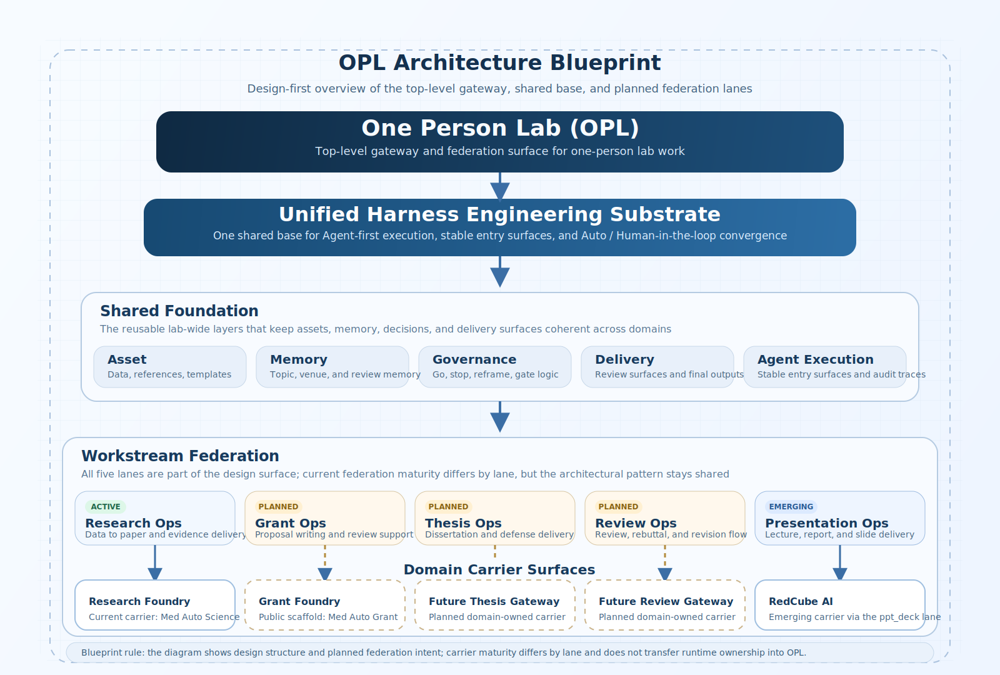

<p align="center">
  
</p>

<p align="center">
  <a href="./README.md"><strong>English</strong></a> | <a href="./README.zh-CN.md">中文</a>
</p>

<h1 align="center">One Person Lab</h1>

<p align="center"><strong>The product shell and module manager for one-person-lab agents</strong></p>
<p align="center">GUI First · Codex Native · Domain Agent Ready</p>

<table>
  <tr>
    <td width="33%" valign="top">
      <strong>Who It Serves</strong><br/>
      Clinicians, researchers, grant writers, educators, and small teams who want one GUI for research, grant, and deliverable work
    </td>
    <td width="33%" valign="top">
      <strong>What It Covers</strong><br/>
      General Codex conversation, executable Codex tasks, and specialized work across research, grants, and presentations
    </td>
    <td width="33%" valign="top">
      <strong>Public Role</strong><br/>
      `OPL` is the product shell that chooses a work mode, manages modules, and keeps long-running work plus files visible from one place
    </td>
  </tr>
</table>

<p align="center">
  
</p>

> `OPL` is a GUI-first product shell for a one-person lab. It organizes work in three public layers: product shell, product families, and current implementations. The current strongest implementations are medical research, medical grant writing, and visual deliverables.

## Current Coverage

- Open one GUI and choose the right working mode before starting.
- Use ordinary Codex conversation for discussion, reading, planning, and quick clarification.
- Turn a goal into a general Codex task when the work needs files, commands, or multi-step execution.
- Send specialized work to product families such as `Research Foundry`, `Grant Foundry`, and `Presentation Ops`.
- Track progress and produced files in the workspace side rail.
- Manage installed modules, local entry points, versions, and upgrades from settings.

## GUI Work Modes

| Mode | Primary agent | Use it for | Current status |
| --- | --- | --- | --- |
| Ordinary Codex conversation | Codex | Discussion, explanation, lightweight planning, and quick analysis | Default GUI mode |
| General Codex task | Codex task runner | Repository work, file edits, verification, and longer local tasks | Default execution mode |
| Specialized product-family modules | `MAS`, `MAG`, `RCA` | Research, grant work, and visual deliverables | Active module family |

The GUI treats these three modes as peers. `Hermes-Agent` is exposed separately as the explicit backup online gateway.
The active execution path remains `Codex-only` local sessions as the current development host, while the preferred future substrate direction is a true upstream `Hermes-Agent` integration proved in a domain repository first.

## Product Families

| Product family | Current implementation | Current scope | Status |
| --- | --- | --- | --- |
| Research Foundry | `MAS` / [`Med Auto Science`](https://github.com/gaofeng21cn/med-autoscience) | Medical research, evidence packaging, manuscript delivery | Active |
| Grant Foundry | `MAG` / [`Med Auto Grant`](https://github.com/gaofeng21cn/med-autogrant) | Medical grant directions, proposal writing, author-side reviewer simulation | Active repository line |
| Presentation Ops | `RCA` / [`RedCube AI`](https://github.com/gaofeng21cn/redcube-ai) | Reports, lecture decks, slides, and visual deliverables | Active |
| Thesis Ops | Planned | Dissertation assembly and defense preparation | Definition stage |
| Review Ops | Planned | Review, rebuttal, and revision workflows | Definition stage |

`OPL` keeps the shell stable, product families define the kind of work, and current implementations carry domain-specific truth. The current active implementations happen to be medical; the shell itself is organized by work family and can host additional domains over time.

## Progress, Files, And Settings

The right-side workspace rail and settings area should make long-running work easy to follow with clear execution visibility:

- Human-readable progress updates such as accepted, gathering material, drafting, running, waiting for review, and delivering files.
- A task-oriented file area that keeps drafts, reports, slides, tables, and other deliverables visible per workspace.
- Resume-ready status cards that connect recent progress, running tasks, and the files already produced.
- A module catalog that shows installed implementations, health, upgrades, pinned versions, and default launch preferences.
- Explicit online gateway configuration for `Hermes-Agent` backup runs.

## How To Read This Repository

1. Potential users and human experts should start here, then continue to [Roadmap](./docs/roadmap.md), [Task Map](./docs/task-map.md), and [Operating Model](./docs/operating-model.md).
2. Technical readers and planners should continue to [Docs Guide](./docs/README.md), then read [Project](./docs/project.md), [Status](./docs/status.md), [Architecture](./docs/architecture.md), [Invariants](./docs/invariants.md), and [Decisions](./docs/decisions.md).
3. Developers and maintainers should use [Contracts Overview](./contracts/README.md), [Reference Index](./docs/references/README.md), and the tracked records under `docs/specs/`, `docs/plans/`, and `docs/history/omx/`.

## Plain-Language Architecture

`OPL` is the user-facing shell above Codex and the product families.
Its job is to present the work modes, keep families and modules manageable, and make domain implementations available through one lab workspace.

```text
Human
  -> OPL GUI Product Shell
      -> Codex Conversation
      -> General Codex Task
      -> Product Families
          -> Research Foundry -> MAS / Med Auto Science
          -> Grant Foundry -> MAG / Med Auto Grant
          -> Presentation Ops -> RCA / RedCube AI
      -> Settings: Modules / Upgrades / Health / Gateway
      -> Hermes-Agent Online Gateway
```

In plain language:

- `OPL` owns the GUI shell, mode picker, progress view, file area, settings, and upgrade path.
- Product families define the durable work categories: research, grants, presentation, thesis, and review.
- Current implementations such as `MAS`, `MAG`, and `RCA` carry the domain-specific capability and repository truth.
- Codex remains the default conversation and general task engine.
- `Hermes-Agent` stays available as backup mode and online gateway.

<details>
  <summary><strong>Technical Notes And Current Implementation Truth</strong></summary>

`OPL` now ships a local direct product-entry shell whose default front door is `opl`.
The frozen product-entry choice is `external kernel, managed by OPL product packaging`, not requiring users to manually install and understand `Hermes-Agent`.
The current user-facing chain is `User -> OPL Product Entry -> OPL Gateway -> Domain Handoff -> Domain Product Entry / Domain Gateway`.
The local web front desk pilot is landed, while the hosted web front desk is still not ready.

`OPL` currently materializes the product shell in local CLI and GUI-facing surfaces.
The public product direction is `GUI -> mode selection -> Codex or domain module`.
`opl frontdesk bootstrap --path <workspace>` prepares the local `OPL Atlas` Desktop shell.
`opl web` remains the local browser companion.
`opl`, `opl "<request...>"`, `opl ask`, and `opl chat` remain shell surfaces around the same product entry.

The explicit CLI surface order stays visible as `opl doctor`, `opl ask`, `opl chat`, `opl resume`, `opl sessions`, `opl logs`, `opl repair-hermes-gateway`, and `opl web`.
`opl "<request...>"` remains the quick-ask shell path around the same direct product entry.

Codex is the default engine for ordinary conversation and general local tasks.
Domain agents remain independently owned modules with their own repository truth.
`Hermes-Agent` is the explicit backup mode and online gateway for selected remote or alternate runtime paths.

The shared architectural language under `OPL` remains the `Unified Harness Engineering Substrate`, with its most important shared pieces converging into the [Shared Runtime Contract](./docs/shared-runtime-contract.md) and the [Shared Domain Contract](./docs/shared-domain-contract.md).
The module catalog and settings surface should expose the installed domain agents, their health, and their upgrade state.

`Phase 1 / G2 release-closeout` stays frozen as the top-level public baseline for the shared runtime layer, hosted entry surfaces, and any real `Hermes-Agent` rollout.
The current public federation freeze is the `Minimal admitted-domain federation activation package`. It covers the two already admitted domain surfaces, `MedAutoScience` and `RedCube AI`, while the formal entry remains the same local `TypeScript CLI`-first / gateway contract surface and runtime ownership stays with the admitted domains.
`Grant Foundry -> Med Auto Grant` is the active grant-domain repository line. At the `OPL` layer, its top-level federation admission and domain handoff wording remains separately gated.

Current family state is intentionally uneven and should be described honestly:

- `Research Foundry -> MAS / Med Auto Science` is the active medical research implementation.
- `Grant Foundry -> MAG / Med Auto Grant` is the active medical grant implementation.
- `Presentation Ops -> RCA / RedCube AI` is the active visual-deliverable implementation.
- Future thesis and review modules stay in definition.

If you need the full technical reading path, continue to the [Docs Guide](./docs/README.md).
</details>

## Further Reading

- [Roadmap](./docs/roadmap.md)
- [Task Map](./docs/task-map.md)
- [Operating Model](./docs/operating-model.md)
- [Unified Harness Engineering Substrate](./docs/unified-harness-engineering-substrate.md)
- [Docs Guide](./docs/README.md)
- [Project](./docs/project.md)
- [Status](./docs/status.md)
- [Contracts Overview](./contracts/README.md)
