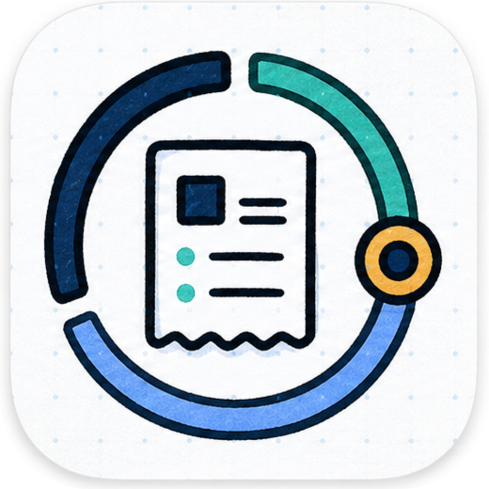
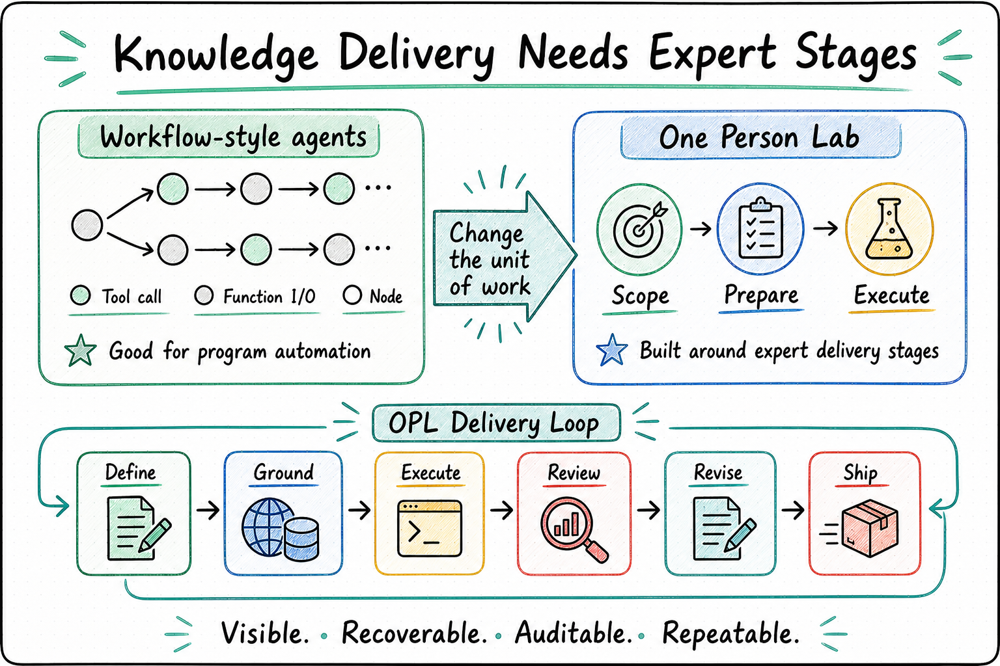
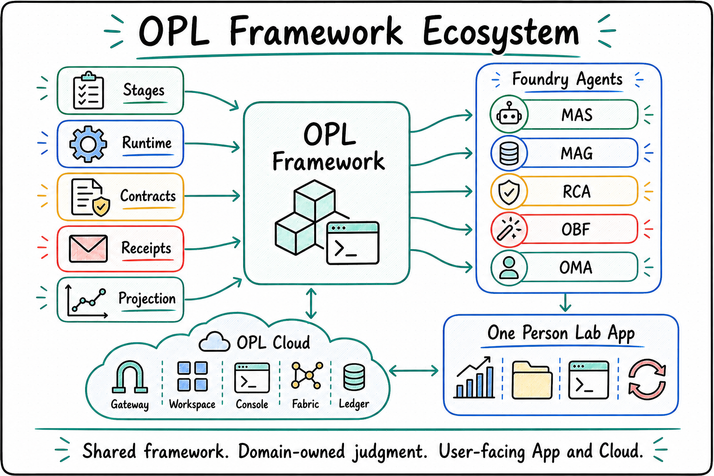

<p align="center">
  
</p>

<p align="center">
  <a href="./README.md"><strong>English</strong></a> | <a href="./README.zh-CN.md">中文</a>
</p>

<h1 align="center">One Person Lab</h1>

<p align="center"><strong>An AI agent framework and workbench for complex knowledge work</strong></p>
<p align="center">Move papers, grants, presentations, patents, and other demanding projects beyond one-shot answers into sustained progress, review, revision, and delivery.</p>

<p align="center">
  
</p>

## Why One Person Lab

AI can already answer a question, generate code, or polish a document. The harder problem is finishing work that spans many sessions: a paper, a grant proposal, a defense deck, a patent package, or a research line that needs to keep moving for weeks.

These tasks raise the same practical questions:

- After many rounds of work, where exactly are we?
- Which sources were used, which files changed, and what evidence was left behind?
- Can preparation, execution, review, revision, and delivery keep clear boundaries?
- Can work continue while the user is away, then report progress, blockers, and next steps?
- Can specialized agents share one runtime, file, progress, and delivery system?

**One Person Lab is built around those questions.**

It breaks complex knowledge work into stages that can actually move forward: prepare the material, do the work, review quality, revise, and close out delivery. Each stage works toward a real deliverable increment. AI can organize sources, propose options, compare tradeoffs, use tools, accept review, and revise again; users can still see progress, files, evidence, blockers, and the next step.

## Core Highlights

<table width="100%">
<tr>
<td width="50%" valign="top">

**Turn long tasks into forward-moving stages**

Papers, grants, presentations, and patents usually need many rounds. OPL gives each round a clear goal, output, review point, and next step; AI can read material, compare options, accept review, and revise inside the stage.

</td>
<td width="50%" valign="top">

**Specialized agents for specialized work**

Medical research, grant writing, visual delivery, book writing, and agent building are handled by different Foundry Agents. Users see one workbench, while each agent keeps its own material understanding, review style, quality standards, and delivery boundary.

</td>
</tr>
<tr>
<td width="50%" valign="top">

**Progress, evidence, and files stay traceable**

You can see which sources were used, what results were produced, which files changed, and what report was left behind. When a task fails, the reason is visible: missing material, human approval, quality issue, or runtime problem.

</td>
<td width="50%" valign="top">

**Hosted long-running work**

OPL is designed for multi-round work, background execution, periodic checks, failure recovery, and human review.

</td>
</tr>
</table>

## One-Sentence View

**One Person Lab makes AI agents behave like a hosted professional team: they move complex tasks forward by stage, produce files, leave evidence, report blockers, and close out deliverables.**

If ordinary AI tools answer "what should I say now?", One Person Lab answers "how does this complex work reach delivery?"

## Cognitive Computation for Complex Deliverables

Ordinary automation is good at fixed steps: do A, then B, then output C. Complex knowledge work needs stronger judgment inside the stage. A paper, proposal, or formal presentation often needs repeated judgment, comparison, rewriting, review, and correction.

The key idea is **cognitive computation**: AI understands, compares, creates, reviews, and revises inside an observable stage. OPL keeps progress, evidence, files, and handoff boundaries organized, while professional AI agents decide how to use sources, tools, candidate options, and revision cycles around the stage goal.

One Person Lab's advantage is that users can still see where the work stands, what should happen next, and where it is blocked, while each professional AI agent has enough room to do real expert work inside a stage: read material, generate several options, compare them, revise from review, and produce the next inspectable version.

With this design, OPL keeps attention on real progress: whether the next version exists, the evidence is clear, review has happened, and the handoff can continue.

## Designed For Professional Teamwork

Workflow tools are strongest when the task is deterministic: call a few tools, fill a few fields, and produce a fixed output. High-value knowledge work behaves more like a professional team moving a project forward: someone prepares material, someone creates, someone reviews, someone revises, and someone closes out delivery. OPL organizes those roles and stages so AI keeps producing inspectable, editable, deliverable work.

<p align="center">
  
</p>

## Product Layers

One Person Lab has three user-visible layers:

| Layer | Audience | Role |
| --- | --- | --- |
| **OPL Framework** | Developers, technical operators, product integration | Runs long tasks, records progress and evidence, supports recovery/retry, and keeps human intervention visible. |
| **One Person Lab App** | End users | Desktop workbench for choosing tasks, watching progress, opening files, handling blockers, and receiving updates. |
| **Foundry Agents** | Specialized work | MAS, MAG, RCA, Book Forge, and later agents provide professional capabilities and deliverables for medical research, grant writing, visual delivery, book writing, and more. |

The chain is straightforward: host specialized agents with OPL Framework, then package the framework and agents into a desktop product users can run directly.

Users do not need to understand the repository split to use the product. For developers: `one-person-lab` maintains the framework and CLI, `one-person-lab-app` maintains the desktop product and release experience, and MAS, MAG, RCA, Book Forge, and other repositories maintain their professional capabilities, standards, and deliverables.

For the complete repository split, see the [OPL family repository map](./docs/public/repo-map.md).

The desktop product follows the Codex App interaction shape and presents MAS, MAG, RCA, and later Foundry Agents as built-in task entries. Users do not need to choose the underlying executor or shell implementation; those details stay in developer diagnostics and verification material.

<p align="center">
  
</p>

## Current Product Lines

| Product line | Current agent | Best for | Typical deliverables |
| --- | --- | --- | --- |
| `Agent Foundry` | [`OPL Meta Agent`](https://github.com/gaofeng21cn/opl-meta-agent) | Turning create, takeover, and improve intent into agent design and evidence-grounded evolution semantics through `engineer-agent` | `AgentBlueprint`, `EvalSpec`, `EvolutionProposal` |
| `Research Foundry` | [`Med Auto Science`](https://github.com/gaofeng21cn/med-autoscience) | Medical research, evidence organization, analysis, manuscript preparation | Analysis packages, evidence packages, manuscripts |
| `Grant Foundry` | [`Med Auto Grant`](https://github.com/gaofeng21cn/med-autogrant) | Grant direction setting, proposal writing, revision preparation | Proposals, outlines, revision packs |
| `Presentation Foundry` | [`RedCube AI`](https://github.com/gaofeng21cn/redcube-ai) | Lectures, lab talks, reports, defenses, project materials | Slide decks, scripts, presentation packages |
| `Book Foundry` | [`OPL Book Forge`](https://github.com/gaofeng21cn/opl-bookforge) | Books, long-form manuscripts, chapter architecture, style control | Storylines, chapter drafts, figure/table plans, DOCX/PDF handoff packages |
| `Patent Foundry` | Planned | Patent applications, invention disclosures, claims, embodiments | Invention disclosures, patent drafts, claim sets |
| `Award Foundry` | Planned | Awards, achievement summaries, evidence organization | Award applications, summaries, evidence packs |
| `Thesis Foundry` | Planned | Thesis assembly and defense preparation | Chapter drafts, defense materials |
| `Review Foundry` | Planned | Review, rebuttal, and revision work | Review comments, response drafts, revision plans |

## Getting Started

To use the desktop product, download One Person Lab App from the App repository:

[Download One Person Lab App](https://github.com/gaofeng21cn/one-person-lab-app/releases/latest)

The desktop product one-shot installer, complete first-install package, Docker/WebUI entry point, GitHub Releases, and user tutorials are maintained by the App repository. This repository maintains the CLI, initialization flow, runtime, contracts, module management, and machine-readable App interfaces behind those entries.

To develop a new domain agent, debug the CLI, or integrate runtime surfaces, open the technical entry below.

## For Codex / Agents

On a new machine, ask Codex to install the OPL runtime, MAS/MAG/RCA/Book Forge/OMA agent surfaces, OPL Flow, OPL Doc, and companion tools from the [new-machine Codex bootstrap guide](docs/references/current-support/opl-new-machine-codex-bootstrap.md):

```text
Please follow the official One Person Lab new-machine guide and set up this machine with the OPL agent runtime environment and the complete Codex workflow toolkit.
Source of truth: https://github.com/gaofeng21cn/one-person-lab/blob/main/docs/references/current-support/opl-new-machine-codex-bootstrap.md
```

## Product Roadmap

- Improve the desktop App first-install package, update channel, and cross-platform release workflow.
- Continue strengthening long-task progress with recovery, retry, human approval, stage review, and clearer progress views.
- Use OPL Meta Agent's `engineer-agent` action as the only public Agent Foundry entry for create, takeover, and improve semantics; let the Foundry Kernel materialize, evaluate, version, canary, activate, and roll back candidates, with protected-test definitions, final acceptance, permissions, and production adoption owned by the target owner.
- Stabilize the Research, Grant, Presentation, and Book Foundry user experience.
- Maintain Book Forge as a default standard Foundry Agent surface in OPL Connect / App while keeping manuscript quality, export handoff, publication, and production-ready claims owner-gated.
- Bring Patent, Award, Thesis, and Review work into the same product family.
- Unify module installation, skill sync, artifact browsing, and workspace recovery across domain agents.

## Technical Entry

<details>
  <summary><strong>Developer and agent notes</strong></summary>

### Common Commands

Source development entry:

```bash
git clone https://github.com/gaofeng21cn/one-person-lab.git
cd one-person-lab
npm install
npm link
```

Common framework commands:

```bash
opl help --text
opl connect modules
opl connect exec --module medautoscience -- doctor entry-modes
opl connect sync-skills
opl family-runtime status
opl family-runtime repair
opl family-runtime provider repair --provider temporal
opl family-runtime attempt list
```

Automation should prefer `opl help --json`, machine-readable contracts under `contracts/`, and projection data exported by the domain agents.

### Framework Responsibility

This repository maintains the One Person Lab framework layer:

- CLI entry points for installation, initialization, diagnostics, and repair.
- Explicit activation, route orchestration, stage control, cognitive computation kernel boundaries, handoff, receipts, human gates, and recovery.
- Temporal runtime provider, stage-attempt projection, attempt ledger, runtime snapshots, and projection consumption.
- Machine-readable contracts, module discovery, `opl connect exec`, and Connect skill synchronization.

OPL follows an AI-first, contract-light surface model: the active framework narrative is `Minimal Trust Kernel + Stage Strategy Kernel + Readiness + Derived Diagnostic Lenses + Surface Budget + AI Capability Aperture`. The kernel admits stage packs and binds owner boundaries, permissions, expected receipts, audit, replay, and route-back evidence. Prompt/skill/tool-affordance/knowledge/rubric refs are strategy and boundary refs for inspectability and reuse, but their completeness is not an OPL launch hard gate. Tool refs are an affordance catalog, not a workflow script: OPL standardizes permission, credential, write-scope, side-effect, and forbidden-authority boundaries, while the executor decides which tools to use, skip, combine, replace, or ask about during the attempt. Readiness aggregates launch and evidence gaps without issuing domain verdicts. Diagnostic lenses can explain blockers, stale assumptions, replay gaps, or route-back evidence, but they do not become runtime planners, proof assistants, workflow compilers, or quality authorities. The surface budget keeps new default surfaces limited to launch safety, authority boundary, evidence/replay/audit/route-back, or repeated App/runtime consumption; other learning points stay as refs, warnings, diagnostics, or history. The AI Capability Aperture keeps open-ended expert work available to stronger executors while routing quality, publication, fundability, visual, and export judgment back to independent AI reviewer or domain-owner receipts.

Temporal-backed provider support is the production online runtime target. Local/offline diagnostics use projection/readback indexes, not provider fallback. Codex CLI is the current first-class executor; Hermes-Agent, Claude Code, and similar tools can enter as explicit executor adapters with receipts and auditability.

### Documentation

- [Documentation index](./docs/README.md)
- [Public docs](./docs/public/README.md)
- [OPL family repository map](./docs/public/repo-map.md)
- [OPL whitepaper series](https://gaofeng21cn.github.io/one-person-lab/latest/whitepapers/)
- [Project overview](./docs/project.md)
- [Current status](./docs/status.md)
- [Architecture](./docs/architecture.md)
- [Invariants](./docs/invariants.md)
- [Decisions](./docs/decisions.md)
- [Contracts directory guide](./contracts/README.md)
- [Public roadmap](./docs/public/roadmap.md)

</details>
