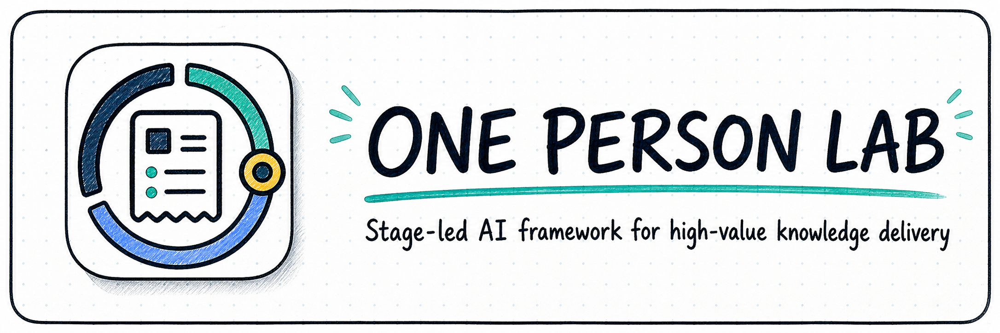
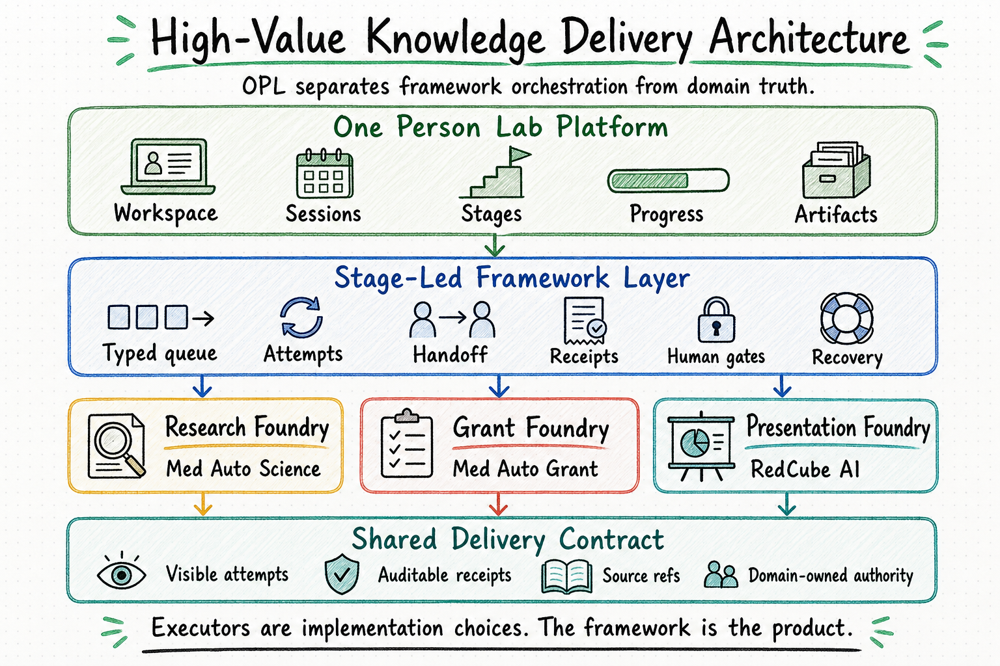

<p align="center">
  
</p>

<p align="center">
  <a href="./README.md"><strong>English</strong></a> | <a href="./README.zh-CN.md">中文</a>
</p>

<h1 align="center">One Person Lab</h1>

<p align="center"><strong>A stage-led agent framework for high-value knowledge delivery</strong></p>
<p align="center">Run expert work the way specialists actually deliver it: define the problem, prepare evidence, execute, review, revise, and ship auditable outcomes.</p>

<p align="center">
  
</p>

## Why One Person Lab

Most agent frameworks are workflow systems: they break work into program nodes, tool calls, function inputs, and activity outputs. That model is useful for software-like automation, but it is a poor fit for high-value knowledge delivery, where the hard part is not calling the next tool. The hard part is knowing what stage the work is in, what evidence is sufficient, how quality should be judged, and what can safely move forward.

One Person Lab uses expert stages as the core unit. A stage carries a goal, source material, quality criteria, handoff, receipt, and owner boundary. Inside each stage, a domain agent can read, reason, write, compute, review, and revise before returning a domain-owned verdict. OPL keeps the work visible, recoverable, auditable, and ready for the next stage.

That is why OPL is designed for papers, grants, presentations, patents, awards, reviews, and other professional outcomes where a simple workflow graph is not enough.

<p align="center">
  
</p>

## What New Users Can Do First

- **Medical research**: move evidence organization, analysis, manuscript drafts, and deliverable packages forward.
- **Grant applications**: shape a grant direction, structure a proposal, and prepare revision packages.
- **Presentations and PPT**: prepare lectures, lab talks, defenses, and project reports.
- **General high-value knowledge work**: keep discussion, file reading, document editing, progress, and deliverables in one place.

## Fast Start

For macOS desktop users, download the App directly:

[Download One Person Lab for macOS](https://github.com/gaofeng21cn/one-person-lab/releases/latest)

Open `One Person Lab.app`; on first launch it quietly checks the local environment, uses your home directory as the default workspace root, and installs or reuses the execution engine, the configured OPL family runtime provider, domain modules, recommended skills, and companion tools such as the `officecli` binary. Full OPL readiness requires Core ready, Domain modules ready, and a configured family runtime provider ready. The production target is a Temporal-backed provider for durable stage attempts; Hermes/local provider paths are migration or legacy signals until that target lands.

If you prefer Terminal installation:

```bash
curl -fsSL https://raw.githubusercontent.com/gaofeng21cn/one-person-lab/main/install.sh | bash
```

After installation, open `One Person Lab.app` and start general work, medical research, grant writing, or presentation/PPT work from the same interface. The App reuses the setup done by `opl install`; it only asks for configuration when a required core dependency cannot be installed or detected automatically.

Need Docker, Linux, or server deployment? See the [Docker and browser deployment reference](./docs/references/current-support/opl-docker-webui-deployment.md).

## Current Product Families

| Product family | Current product | Best for | Typical deliverables |
| --- | --- | --- | --- |
| `Research Foundry` | [`Med Auto Science`](https://github.com/gaofeng21cn/med-autoscience) | Medical research, evidence organization, manuscript preparation, deep analysis | Analysis packages, evidence packages, manuscripts |
| `Grant Foundry` | [`Med Auto Grant`](https://github.com/gaofeng21cn/med-autogrant) | Grant direction setting, proposal writing, revision work | Proposals, outlines, revision packs |
| `Presentation Foundry` | [`RedCube AI`](https://github.com/gaofeng21cn/redcube-ai) | Lectures, lab talks, reports, defense materials | Slide decks, scripts, presentation packages |
| `IP Foundry` | `Med Auto Patent` planned | Patent applications, invention disclosures, claims, embodiment organization | Invention disclosures, patent drafts, claim sets |
| `Award Foundry` | `Med Auto Award` planned | Science-and-technology award applications, achievement summaries, impact evidence | Award applications, achievement summaries, evidence packs |
| `Thesis Foundry` | `Med Auto Thesis` planned | Thesis assembly and defense preparation | Chapter drafts, defense materials |
| `Review Foundry` | `Med Auto Review` planned | Review, rebuttal, and revision work | Review comments, response drafts, revision plans |

## How The Workbench Is Organized

- General work for discussion, planning, reading, and common tasks.
- Workspace-based work for tasks that need a real directory and persistent file context.
- Specialized product families for domain-specific expert workflows.
- Stage-led execution: OPL treats each domain stage as the observable work unit, with goals, evidence, review, receipts, recovery, and owner boundaries attached to the stage.
- Progress and file views that stay attached to ongoing work.
- Central management for the default executor, the OPL family runtime provider, modules, skills, GUI, and health status.

## For Agents And Technical Operators

<details>
  <summary><strong>Quick technical entry</strong></summary>

### One instruction for an operator agent

> Install and configure this OPL repo: clone it, install the OPL CLI, run `opl install`, and ensure the default executor, the configured OPL family runtime provider, MAS/MAG/RCA, recommended skills, required companion tools such as the `officecli` binary, the One Person Lab App, and the browser entry are ready; if anything is missing, fix it or report the exact blocker. The current packaged default executor is Codex CLI. Treat Temporal-backed execution as the production substrate candidate for durable stage attempts, human-gate signals, retries, queries, and history; treat Hermes-Agent as a legacy/optional provider or executor/proof lane during migration while keeping domain truth in MAS/MAG/RCA.

### Common commands after installation

```bash
opl system initialize   # Inspect executor policy, family runtime provider, modules, skills, GUI, and workspace-root state
opl family-runtime status
opl family-runtime repair
opl family-runtime attempt create --domain medautoscience --stage scout --provider local_sqlite --workspace-locator '{"workspace_root":"/path/to/workspace"}'
opl family-runtime attempt list
opl modules             # Check MAS/MAG/RCA modules and any MAS-declared optional companion provenance/audit refs
opl module exec --module medautoscience -- doctor entry-modes
opl skill sync          # Sync OPL family skills into the agent-visible skill path
opl help --text         # Human-readable help; use opl help --json for machine-readable output
```

### What this repository tracks

This repository tracks the OPL framework layer, not the specialized domain-agent implementations. It keeps the product family coherent by providing:

- A common place to start and resume expert work.
- Module installation, skill sync, service setup, and health checks.
- Workspace, session, stage attempt, progress, and artifact discovery surfaces.
- Shared contracts that let Research, Grant, and Presentation Foundries stay visible from one workbench.

Architecturally, OPL is a complete stage-led family agent runtime framework for high-value knowledge delivery. It may use external providers and concrete executors, but its framework boundary is OPL-owned: activation, typed family queue, durable session/runtime support, stage attempt ledger, wakeup/retry/approval transport, shared discovery, and projection. Domain agents own their own stage semantics, prompts, skills, quality gates, truth reducers, and deliverable authority. This lets OPL support MAS/MAG/RCA and target fully automated delivery of high-value knowledge work without becoming their domain brain.

For the MAS v2 alignment, `Med Auto Science` remains an independent medical research domain agent with a single domain app skill entry consumed by OPL and the operator environment. OPL owns the unified definitions, shared contract/index registration, module discovery, and projection consumption layer; it does not become the MAS runtime kernel, does not restore a MAS standalone release/install channel, and does not turn MAS projections into OPL-owned readiness or publication verdicts.

The desktop GUI source is maintained in [`opl-aion-shell`](https://github.com/gaofeng21cn/opl-aion-shell) as an internal OPL-branded app-shell build input. Users download One Person Lab App packages from this repository’s GitHub Releases; first-time macOS arm64 users can choose the `One-Person-Lab-Full-<version>-mac-arm64.dmg` asset with MAS/MAG/RCA, the current family runtime provider payload, `officecli`, and recommended companion skill payloads, while in-app updates continue to use the standard App assets and `latest*.yml` metadata. This repository provides the shared workbench contracts and product surfaces consumed by the app and operator environment.

### How to read this repository

1. Users should start with this README and the App / `opl install` path above.
2. Technical planning, architecture decisions, and direction sync continue through the [documentation index](./docs/README.md), then [project overview](./docs/project.md), [current status](./docs/status.md), [architecture](./docs/architecture.md), [invariants](./docs/invariants.md), and [decisions](./docs/decisions.md).
3. Developers and maintainers should continue with the [contracts directory guide](./contracts/README.md), [reference index](./docs/references/README.md), current specs under `docs/specs/`, and archived process material through the [history index](./docs/history/README.md).

### Runtime notes

- Default front doors are `opl`, `opl exec`, and `opl resume`. Unless a runtime or domain agent is explicitly selected, these paths use the configured default executor semantics.
- OPL's orchestration unit is the domain `stage`. Large tasks should advance through stages that resemble how a human expert would scope, prepare, execute, review, revise, and close out the work. Stage descriptors, handoff envelopes, receipts, and projection metadata live at the family framework layer, while stage internals remain domain-owned and executed by the selected executor.
- OPL treats `Codex CLI` as a managed runtime dependency: `opl system` reports the selected binary, version, minimum-version policy, and PATH diagnostics. Health is based on the selected binary; non-selected PATH candidates are reported as diagnostics instead of blocking a compatible Codex CLI.
- The OPL family runtime is becoming provider-backed. Temporal is the preferred production substrate candidate for durable stage-attempt workflows, activity retry/timeout, human-gate signals, status queries, and execution history. Hermes-Agent remains a legacy/optional provider or explicit executor/proof lane during migration; it is not the target long-term session/wakeup substrate once the Temporal provider lands.
- `Codex CLI` remains the default concrete executor unless a route explicitly chooses another executor. A family runtime provider does not become MAS/MAG/RCA domain truth, quality authority, artifact authority, or publication/package gate.
- Use `opl family-runtime status|doctor|repair|intake|tick|enqueue|attempt create|attempt list|attempt inspect|queue list|approve|notify list|events export` for the OPL family runtime bridge and stage attempt ledger. `opl install --no-online-runtime` and provider-disable environment switches are development/offline diagnostic modes and report degraded Full readiness.
- First launch requires Core ready, Domain modules ready, and the configured family runtime provider ready before Full readiness passes. During migration, local CLI/status/manifest diagnostics may still expose Hermes/local provider state as a legacy readiness signal.
- If an admitted domain repo is missing locally, run `opl module install --module <module_id>`.
- When automation needs a domain CLI, run it through `opl module exec --module <module_id> -- <domain_cli_args...>` so the command is launched from the current OPL-managed module checkout instead of a stale global PATH tool.
- The default workspace root is your home directory. The default local state directory is `~/Library/Application Support/OPL/state`. Set `OPL_STATE_DIR` to use another local state root.
- Active domain agents are [`Med Auto Science`](https://github.com/gaofeng21cn/med-autoscience), [`Med Auto Grant`](https://github.com/gaofeng21cn/med-autogrant), and [`RedCube AI`](https://github.com/gaofeng21cn/redcube-ai).
- `Med Auto Science` exposes one MAS domain app skill for OPL and operator activation. OPL syncs and consumes that skill plus MAS-owned projections as shared workbench surfaces; MAS keeps the medical research runtime, controller truth, quality authority, and publication gates.
- [`Med Deep Scientist`](https://github.com/gaofeng21cn/med-deepscientist) is no longer an OPL-installed default MAS runtime dependency. `Med Auto Science` may still expose explicit optional backend-audit, source-provenance, historical-fixture, explicit archive-import, upstream-intake, and parity-oracle references; OPL consumes those only as MAS-declared companion provenance/audit refs, not as a top-level domain agent or default module.
- When a task needs top-level session/runtime paths, shared `workspaces / sessions / progress / artifacts` surfaces, or explicit domain activation, enter through `OPL`. When a task is already clearly inside one domain, continue through that repo’s README and `docs/README*`.

</details>

## Further Reading

- [Roadmap](./docs/public/roadmap.md)
- [Task map](./docs/public/task-map.md)
- [Operating model](./docs/public/operating-model.md)
- [Unified Harness Engineering Substrate](./docs/public/unified-harness-engineering-substrate.md)
- [Documentation index](./docs/README.md)
- [Project overview](./docs/project.md)
- [Current status](./docs/status.md)
- [Contracts directory guide](./contracts/README.md)
