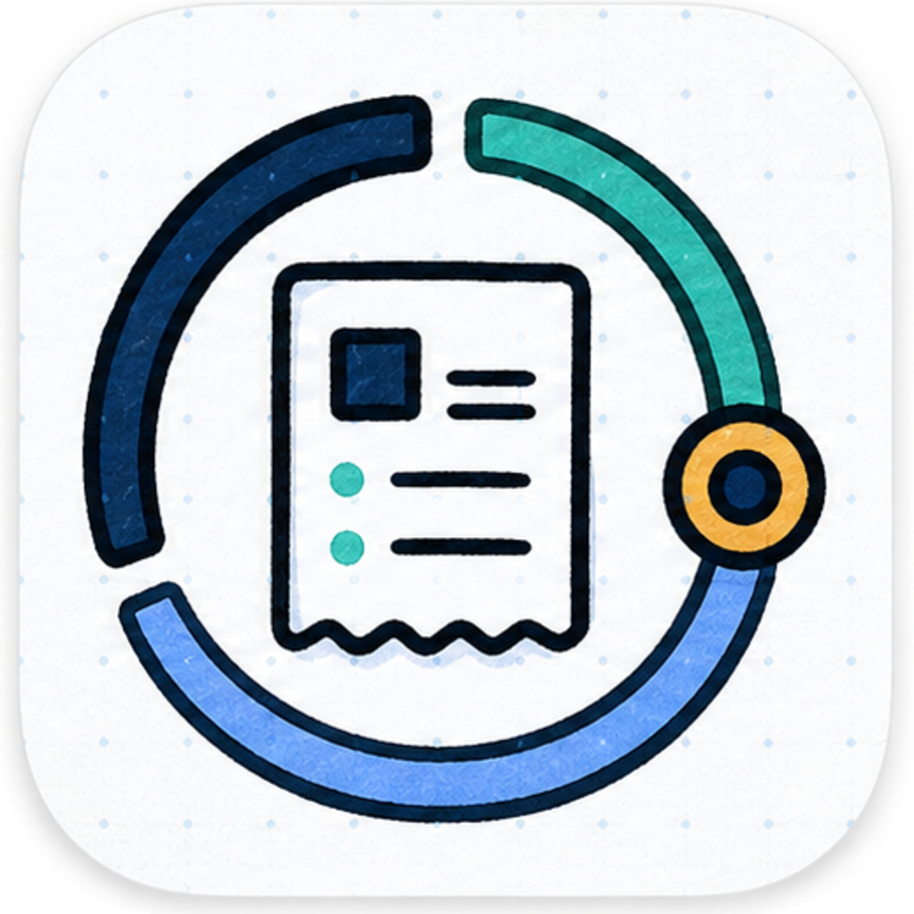
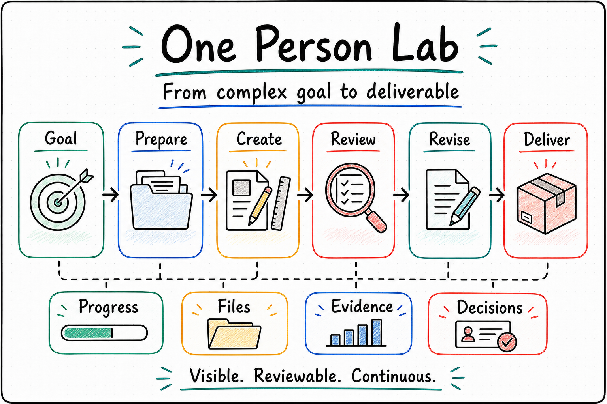

<p align="center">
  
</p>

<p align="center">
  <a href="./README.md"><strong>English</strong></a> | <a href="./README.zh-CN.md">中文</a>
</p>

<h1 align="center">One Person Lab</h1>

<p align="center"><strong>An AI agent framework and workbench for complex knowledge work</strong></p>
<p align="center">Move papers, grants, presentations, patents, and other demanding projects beyond one-shot answers into sustained progress, review, revision, and delivery.</p>

<p align="center">
  
</p>

## Why One Person Lab

AI can already answer a question, generate code, or polish a document. The harder problem is finishing work that spans many sessions: a paper, a grant proposal, a defense deck, a patent package, or a research line that needs to keep moving for weeks.

These tasks raise the same practical questions:

- After many rounds of work, where exactly are we?
- Which sources were used, which files changed, and what evidence was left behind?
- Can preparation, execution, review, revision, and delivery keep clear boundaries?
- Can work continue while the user is away, then report progress, blockers, and next steps?
- Can specialized agents share one runtime, file, progress, and delivery system?

**One Person Lab is built around those questions.**

It breaks complex knowledge work into stages that can actually move forward: prepare the material, do the work, review quality, revise, and close out delivery. Each stage works toward a real deliverable increment. AI can organize sources, propose options, compare tradeoffs, use tools, accept review, and revise again; users can still see progress, files, evidence, blockers, and the next step.

## Core Highlights

<table width="100%">
<tr>
<td width="50%" valign="top">

**Turn long tasks into forward-moving stages**

Papers, grants, presentations, and patents usually need many rounds. OPL gives each round a clear goal, output, review point, and next step; AI can read material, compare options, accept review, and revise inside the stage.

</td>
<td width="50%" valign="top">

**Specialized agents for specialized work**

Medical research, grant writing, visual delivery, book writing, and agent building are handled by different Foundry Agents. Users see one workbench, while each agent keeps its own material understanding, review style, quality standards, and delivery boundary.

</td>
</tr>
<tr>
<td width="50%" valign="top">

**Progress, evidence, and files stay traceable**

You can see which sources were used, what results were produced, which files changed, and what report was left behind. When a task fails, the reason is visible: missing material, human approval, quality issue, or runtime problem.

</td>
<td width="50%" valign="top">

**Hosted long-running work**

OPL is designed for multi-round work, background execution, periodic checks, failure recovery, and human review.

</td>
</tr>
</table>

## One-Sentence View

**One Person Lab makes AI agents behave like a hosted professional team: they move complex tasks forward by stage, produce files, leave evidence, report blockers, and close out deliverables.**

If ordinary AI tools answer "what should I say now?", One Person Lab answers "how does this complex work reach delivery?"

## Cognitive Computation for Complex Deliverables

Ordinary automation is good at fixed steps: do A, then B, then output C. Complex knowledge work needs stronger judgment inside the stage. A paper, proposal, or formal presentation often needs repeated judgment, comparison, rewriting, review, and correction.

The key idea is **cognitive computation**: AI understands, compares, creates, reviews, and revises inside an observable stage. OPL keeps progress, evidence, files, and handoff boundaries organized, while professional AI agents decide how to use sources, tools, candidate options, and revision cycles around the stage goal.

One Person Lab's advantage is that users can still see where the work stands, what should happen next, and where it is blocked, while each professional AI agent has enough room to do real expert work inside a stage: read material, generate several options, compare them, revise from review, and produce the next inspectable version.

With this design, OPL keeps attention on real progress: whether the next version exists, the evidence is clear, review has happened, and the handoff can continue.

## Designed For Professional Teamwork

Workflow tools are strongest when the task is deterministic: call a few tools, fill a few fields, and produce a fixed output. High-value knowledge work behaves more like a professional team moving a project forward: someone prepares material, someone creates, someone reviews, someone revises, and someone closes out delivery. OPL organizes those roles and stages so AI keeps producing inspectable, editable, deliverable work.

## OPL Ecosystem

Users only need four stable product concepts:

| Product | User understanding | Internal authority |
| --- | --- | --- |
| **OPL Base** | The runtime foundation that makes long work runnable, recoverable, and auditable. | `one-person-lab` implements OPL Framework and owns the only Cordis Host for Framework runtime, Package graph, and App projection. |
| **OPL App** | The local workbench for choosing work, watching progress, opening files, and acting on blockers. | `one-person-lab-app` owns the product, GUI ABI, selected Shell, and release. |
| **OPL Packages** | Installable Agents, Skills, Tools, Plugins, and Workflows that add professional capability. | Each Package owner owns identity and publication; Framework discovers and projects installed capabilities. |
| **OPL Cloud** | Online Workspace, account governance, hosted resources, collaboration, and Agent services. | `one-person-lab-cloud` owns Cloud products and services; the product is in active implementation and delivery. |

Foundry Agents such as MAS, MAG, RCA, OMA, and Book Forge are professional
authority domains delivered through OPL Packages. They keep their own quality,
artifact, and delivery decisions; they are not a fifth product layer and are not
Framework plugins by definition.

The Studio implementation may run a separate DeepSeek Harness/Cordis
Application Host for its profile, plugin lifecycle, native Codex backend, and
delivery transports. It consumes Framework/App public contracts and does not
create another OPL runtime, Package registry/currentness authority, App
state/action owner, or product/release authority. The scoped Host boundary is
machine-readable in
[`cordis-architecture-profile.json`](./contracts/opl-framework/cordis-architecture-profile.json).

Users do not need to understand the repository split. For developers:
`one-person-lab` maintains Base/Framework, `one-person-lab-app` maintains the App
product and release experience, Package repositories maintain installable
capabilities, and `one-person-lab-cloud` delivers the online workspaces,
governance, hosted resources, collaboration, and Agent services of OPL Cloud.

For the complete repository split, see the [OPL family repository map](./docs/public/repo-map.md).

The desktop product follows the Codex App interaction shape and presents MAS, MAG, RCA, and later Foundry Agents as built-in task entries. Users do not need to choose the underlying executor or shell implementation; those details stay in developer diagnostics and verification material.

## Current Product Lines

| Product line | Current agent | Best for | Typical deliverables |
| --- | --- | --- | --- |
| `Agent Foundry` | [`OPL Meta Agent`](https://github.com/gaofeng21cn/opl-meta-agent) | Turning create, takeover, and improve intent into agent design and evidence-grounded evolution semantics through `engineer-agent` | `AgentBlueprint`, `EvalSpec`, `EvolutionProposal` |
| `Research Foundry` | [`Med Auto Science`](https://github.com/gaofeng21cn/med-autoscience) | Medical research, evidence organization, analysis, manuscript preparation | Analysis packages, evidence packages, manuscripts |
| `Grant Foundry` | [`Med Auto Grant`](https://github.com/gaofeng21cn/med-autogrant) | Grant direction setting, proposal writing, revision preparation | Proposals, outlines, revision packs |
| `Presentation Foundry` | [`RedCube AI`](https://github.com/gaofeng21cn/redcube-ai) | Lectures, lab talks, reports, defenses, project materials | Slide decks, scripts, presentation packages |
| `Book Foundry` | [`OPL Book Forge`](https://github.com/gaofeng21cn/opl-bookforge) | Books, long-form manuscripts, chapter architecture, style control | Storylines, chapter drafts, figure/table plans, DOCX/PDF handoff packages |

## Getting Started

To use the desktop product, download One Person Lab App from the App repository:

[Download One Person Lab App](https://github.com/gaofeng21cn/one-person-lab-app/releases/latest)

The desktop product one-shot installer, complete first-install package, Docker/WebUI entry point, GitHub Releases, and user tutorials are maintained by the App repository. This repository maintains the CLI, initialization flow, runtime, contracts, module management, and machine-readable App interfaces behind those entries.

To develop a new domain agent, debug the CLI, or integrate runtime surfaces, open the technical entry below.

## For Codex / Agents

On a new machine, ask Codex to install the OPL runtime, MAS/MAG/RCA/Book Forge/OMA agent surfaces, OPL Flow (including its bundled `$software-development` documentation-governance workflow), and companion tools from the [new-machine Codex bootstrap guide](docs/references/current-support/opl-new-machine-codex-bootstrap.md):

```text
Please follow the official One Person Lab new-machine guide and set up this machine with the OPL agent runtime environment and the complete Codex workflow toolkit.
Source of truth: https://github.com/gaofeng21cn/one-person-lab/blob/main/docs/references/current-support/opl-new-machine-codex-bootstrap.md
```

Long-term direction belongs to the [public roadmap](./docs/public/roadmap.md);
concrete implementation gaps belong to [current gaps](./docs/active/current-state-vs-ideal-gap.md).

## Technical Entry

<details>
  <summary><strong>Developer and agent notes</strong></summary>

### Common Commands

Source development entry:

```bash
git clone https://github.com/gaofeng21cn/one-person-lab.git
cd one-person-lab
npm install
npm link
```

Common framework commands:

```bash
opl help --text
opl connect modules
opl connect exec --module medautoscience -- doctor entry-modes
opl connect sync-skills
opl family-runtime status
opl family-runtime repair
opl family-runtime provider repair --provider temporal
opl family-runtime attempt list
```

Automation should prefer `opl help --json`, machine-readable contracts under `contracts/`, and projection data exported by the domain agents.

Framework source owns generic runtime, Package discovery and App projections. Domain owners retain professional facts and verdicts; App owns GUI and release truth. See [architecture](./docs/architecture.md) for ownership and [runtime](./docs/runtime/README.md) for execution semantics.

### Documentation

- [Documentation index](./docs/README.md)
- [Public docs](./docs/public/README.md)
- [OPL family repository map](./docs/public/repo-map.md)
- [OPL whitepaper series](https://gaofeng21cn.github.io/one-person-lab/latest/whitepapers/)
- [Project overview](./docs/project.md)
- [Current status](./docs/status.md)
- [Architecture](./docs/architecture.md)
- [Invariants](./docs/invariants.md)
- [Decisions](./docs/decisions.md)
- [Contracts directory guide](./contracts/README.md)
- [Public roadmap](./docs/public/roadmap.md)

</details>
