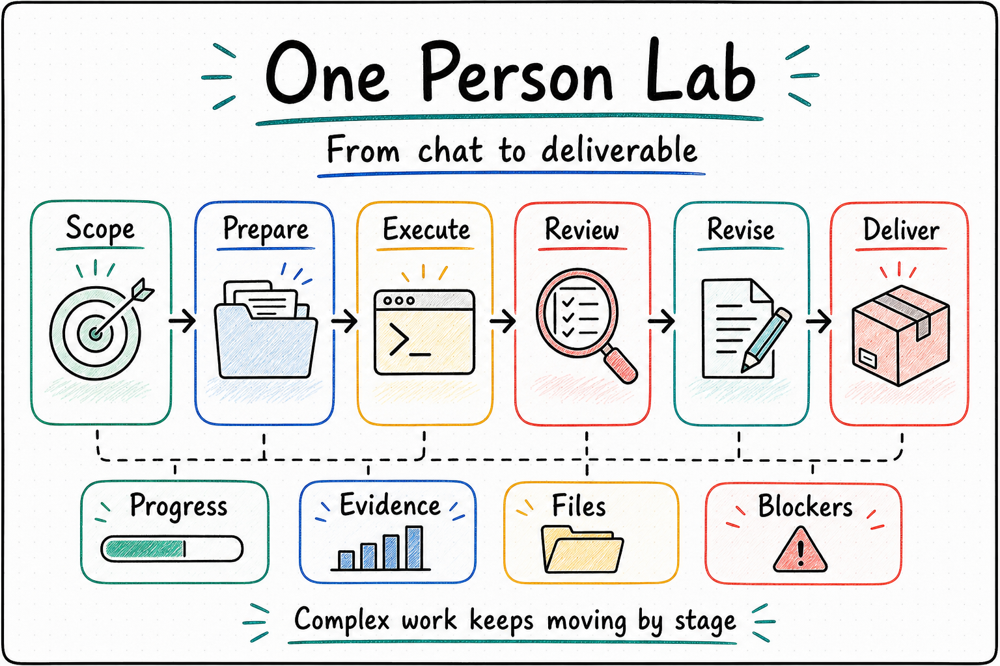

<p align="center">
  
</p>

<p align="center">
  <a href="./README.md">English</a> | <a href="./README.zh-CN.md"><strong>中文</strong></a>
</p>

<h1 align="center">One Person Lab</h1>

<p align="center"><strong>面向高价值知识工作的 AI Agent 工作台与运行框架</strong></p>
<p align="center">以「任务阶段」为单位，让论文、基金、汇报、专利等复杂成果持续推进、可追踪、可交付</p>

<p align="center">
  
</p>

## 为什么是 One Person Lab

AI 已经很擅长回答一个问题、生成一段代码或润色一份材料。但当任务变成一篇论文、一个基金本子、一套答辩材料或一个长期研究项目时，真正困难的是把工作持续推进到能交付。

这些长周期任务通常会遇到几个问题：

- 做了很多轮之后，当前到底推进到了哪一步？
- 中间用了哪些材料、改了哪些文件、留下了哪些证据？
- 准备、执行、审核、修订和交付能不能分清楚，而不是混在一场长对话里？
- 人离开电脑后，任务能不能继续跑，回来时直接看到进展、阻塞和下一步？
- 多个专业 Agent 能不能共用一套运行、文件、进度和交付体系，而不是各自重造一遍？

**One Person Lab 正是围绕这些问题设计的。**

它把复杂知识工作拆成一个个清晰的「任务阶段」：准备材料、执行创作、质量审核、修订完善、交付收口。每个阶段都有目标、材料、产物、进展、证据和下一步，让 AI 不只是“聊天”，而是真正围绕成果持续工作。

## 核心亮点

<table width="100%">
<tr>
<td width="50%" valign="top">

**阶段化推进复杂工作**

论文、基金、汇报、专利不是一次问答能完成的。OPL 把它们组织成可持续推进的任务阶段，让每一步做什么、完成了什么、还卡在哪里都清楚可见。

</td>
<td width="50%" valign="top">

**专业 Agent 各司其职**

医学研究、基金写作、视觉汇报和 Agent 构建分别由不同 Foundry Agent 承担。用户看到的是统一工作台，背后每个专业 Agent 保留自己的判断标准和交付权威。

</td>
</tr>
<tr>
<td width="50%" valign="top">

**进度、证据、文件全程可追踪**

每次运行用了哪些资料、生成了哪些结果、修改了哪些文件、留下了什么报告，都能回看。任务失败时，也能知道是缺材料、缺人工确认、质量未过，还是运行环境问题。

</td>
<td width="50%" valign="top">

**长任务可托管运行**

OPL 不只服务一次性对话。它适合需要多轮推进、后台执行、定期检查、失败恢复和人工介入的长周期任务。

</td>
</tr>
</table>

## 一句话理解

**One Person Lab 让 AI Agent 像一个可托管的专业团队一样工作：按阶段推进复杂任务，持续产出文件，留下证据，遇到阻塞能汇报，完成后能交付。**

如果说普通 AI 工具解决的是“这一问怎么答”，One Person Lab 解决的是“这项复杂工作怎么一步步做到能交付”。

## 和 workflow-style agents 的区别

Workflow-style agents 很适合程序自动化：工具调用、函数输入输出、节点编排和确定性路由。复杂知识交付需要换一个工作单元。论文、基金、汇报或专利不是因为某个节点跑完了就真正推进，而是因为一个专家阶段完成了定义、资料扎根、执行、审阅、修订和交付，并留下可见证据。

<p align="center">
  
</p>

## 产品关系

One Person Lab 同时包含框架、桌面工作台和专业 Agent 三层：

| 层级 | 面向对象 | 作用 |
| --- | --- | --- |
| **OPL Framework** | 开发者、技术操作者、产品集成 | 负责把长任务跑起来、接上专业 Agent、记录进展和证据，并支持恢复、重试和人工介入。 |
| **One Person Lab App** | 终端用户 | 桌面工作台。用户从这里选择任务、查看进度、打开文件、处理阻塞和获取更新。 |
| **Foundry Agents** | 专业工作场景 | MAS、MAG、RCA 等专业 Agent 分别负责医学研究、基金写作、视觉交付和后续更多高价值知识工作。 |

这三层形成一条清晰链路：用 OPL Framework 托管专业 Agent，再把框架和 Agent 打包成普通用户可直接使用的桌面产品。

当前仓库分工是刻意拆开的：`one-person-lab` 持有 framework、runtime、CLI、contracts、generated surfaces 和 App 可消费的 state/action 接口；`one-person-lab-app` 持有 GUI product truth、App release gate、updater metadata、用户教程、截图、首启检查和 active-shell validation；`opl-aion-shell` 是当前 App-owned GUI contract 的实现载体；MAS、MAG、RCA 等 domain repos 持有各自 domain app/runtime authority、domain truth、quality/export verdict、artifact authority、owner receipt 和 direct skill 入口。

普通桌面产品按 Codex App 套壳读取：固定使用 `Codex CLI` 作为 concrete executor，并把 MAS、MAG、RCA 及后续 Foundry Agents 呈现为内置任务入口。AionUI upstream 的 backend/Agent selector、非默认 executor adapter 和 shell implementation 细节只能进入显式 developer/operator diagnostic，不是普通用户产品面。

<p align="center">
  
</p>

## 当前产品线

| 产品线 | 当前智能体 | 适合的工作 | 典型交付物 |
| --- | --- | --- | --- |
| 智能体工坊 | [`OPL Meta Agent`](https://github.com/gaofeng21cn/opl-meta-agent) | 新智能体开发、测试接管、机制自进化 | 智能体基线、测试套件、机制补丁建议 |
| 研究工坊 | [`Med Auto Science`](https://github.com/gaofeng21cn/med-autoscience) | 医学研究、证据整理、数据分析、稿件准备 | 分析包、证据包、稿件 |
| 基金工坊 | [`Med Auto Grant`](https://github.com/gaofeng21cn/med-autogrant) | 基金方向判断、申请书写作、修订准备 | 申请书、提纲、修订包 |
| 汇报工坊 | [`RedCube AI`](https://github.com/gaofeng21cn/redcube-ai) | 讲课、组会、汇报、答辩和项目材料 | 幻灯片、讲稿、汇报材料 |
| 专利工坊 | 规划中 | 专利申请、技术交底、权利要求和实施例整理 | 技术交底书、专利申请书、权利要求书 |
| 报奖工坊 | 规划中 | 科技奖励、成果总结和佐证材料组织 | 报奖书、成果总结、佐证材料包 |
| 论文工坊 | 规划中 | 学位论文装配和答辩准备 | 章节草稿、答辩材料 |
| 审稿工坊 | 规划中 | 审稿、回复和修回 | 评审意见、回复草稿、修回计划 |

## 如何开始

日常用户可以直接下载桌面工作台：

[下载 One Person Lab App](https://github.com/gaofeng21cn/one-person-lab-app/releases/latest)

桌面产品的一键安装、完整首次安装包、Docker/WebUI 入口、GitHub Release 和用户教程由 App 仓维护。本仓维护这些入口背后的命令行、初始化流程、运行时、合同、模块管理和 App 可消费机器接口。

开发新的领域智能体、调试命令行或接入运行时，请展开下方技术入口。

## 给 Codex / Agent

在新机器上，让 Codex 按 [新机器 Codex 全家桶安装入口](docs/references/current-support/opl-new-machine-codex-bootstrap.md) 自动安装配置 OPL runtime、MAS/MAG/RCA/OMA 智能体可见面、OPL Flow、OPL Doc 和推荐 companion tools：

```text
请按 One Person Lab 官方新机器指南，帮我完成这台机器的 OPL 智能体运行环境和 Codex 工作流全家桶安装配置。
Source of truth: https://github.com/gaofeng21cn/one-person-lab/blob/main/docs/references/current-support/opl-new-machine-codex-bootstrap.md
```

## 后续开发计划

- 完善桌面应用的首次安装包、更新通道和跨平台发布流程。
- 继续增强阶段式运行时，让长任务具备更完整的恢复、重试、人工确认和进度投影能力。
- 将 OPL Meta Agent 作为智能体工坊入口，用于开发新领域智能体、接管既有智能体测试，并通过 Agent Lab 组织机制自进化。
- 推进研究工坊、基金工坊、汇报工坊三条产品线的稳定交付体验。
- 将专利、报奖、论文、审稿等高价值知识工作纳入同一产品家族。
- 统一领域智能体的安装、模块发现、技能同步、产物浏览和工作区恢复体验。

## 技术入口

<details>
  <summary><strong>展开开发者与智能体说明</strong></summary>

### 常用命令

本仓源码开发入口：

```bash
git clone https://github.com/gaofeng21cn/one-person-lab.git
cd one-person-lab
npm install
npm link
```

常用框架命令：

```bash
opl help --text
opl modules
opl module exec --module medautoscience -- doctor entry-modes
opl skill sync
opl family-runtime status
opl family-runtime repair
opl family-runtime provider repair --provider temporal
opl family-runtime attempt list
```

自动化集成应优先读取 `opl help --json`、`contracts/` 下的机器可读合同，以及各领域智能体导出的投影数据。

### 框架职责

本仓库维护 One Person Lab 的框架层，负责：

- 命令行入口、安装、初始化、诊断和修复。
- 显式激活、阶段控制、交接、回执、人工确认和恢复。
- 运行时提供者、类型化队列、阶段尝试记录、运行快照和投影消费。
- 机器可读合同、模块发现、`opl module exec` 和技能同步。

OPL 采用 AI-first、contract-light 的 surface 模型：active 框架叙事统一为 `Minimal Trust Kernel + Readiness + Derived Diagnostic Lenses + Surface Budget + AI Capability Aperture`。Kernel 负责 stage pack 准入和 owner boundary、权限、expected receipt、audit、replay、route-back 证据；prompt/tools/knowledge/rubric refs 是为了可审计、可复用和可交接的 AI 策略引用，不是 OPL launch hard gate。Readiness 聚合启动和证据缺口，不签发 domain verdict；Diagnostic lenses 解释 blocker、stale assumption、replay gap 或 route-back evidence，但不升级为 runtime planner、proof assistant、workflow compiler 或质量权威。Surface Budget 限制新增 default surface：不满足启动安全、权威边界、证据/replay/audit/route-back 或 App/runtime 反复消费的学习点，只能进入 refs、warning、diagnostic 或 history。AI Capability Aperture 保持专家工作对更强 executor 开放，让 Codex 和后续更强 AI 能力直接受益；质量、publication、fundability、visual 和 export 判断仍回到独立 AI reviewer 或 domain-owner receipt。

生产在线运行由 Temporal-backed provider 承接；Temporal 是 production online substrate，负责 durable workflow、activity retry/timeout、signal/update、query、visibility 和 event history。local provider 只用于开发、CI 和离线诊断，不能替代 production online readiness。OPL SQLite attempt ledger 记录 stage attempt identity、queue linkage、checkpoint/closeout refs、owner receipt refs、typed blocker refs、human gate 和 dead-letter state；`stage_progress_log` 只是从 Temporal provider refs、OPL ledger refs 和 domain-owned refs 派生的进度投影。其 `user_stage_log` 是标准 OPL Agent 的用户可读进度面：OPL 只投影时间、usage、refs 与显式缺失状态，MAS/MAG/RCA 等 domain agent 用 `stage_work_done` / `changed_stage_surfaces` 提供人话 closeout；缺失时必须显示 `missing_domain_semantic_summary`。Agent Lab 只消费这些 refs 做评估和改进，不拥有 runtime log 或 domain truth。Codex CLI 是当前第一公民执行器；Hermes-Agent、Claude Code 等工具可以作为显式执行器适配器接入，并通过回执与审计信息证明运行过程。

### 文档

- [文档索引](./docs/README.md)
- [项目概览](./docs/project.md)
- [当前状态](./docs/status.md)
- [架构](./docs/architecture.md)
- [硬约束](./docs/invariants.md)
- [关键决策](./docs/decisions.md)
- [合同目录说明](./contracts/README.md)
- [公开路线图](./docs/public/roadmap.md)

</details>
